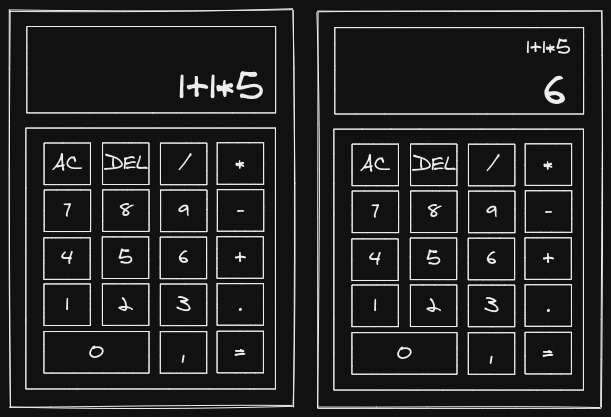

# Calculadora JS

## 1. Fazer uma estrutura contendo display e botões
Fazer a estrutura básica  da calculadora em HTML. Conter botões [0 a 9] [.][+][-][*][/][=][AC][DEL]. Conter um display que mostre conteúdo atual e prévio. 

## 2. Formatar a estrutura usando CSS
Exemplo de tela:

## 3. Ao digitar um número ou operador, fazer aparecer no display
Ao ser digitado um número fazer que o mesmo seja mostrado no display, ao digitar outro número, este deve ser alinhado a direita do anterior.

## 4. Realizar as operações e atualizar o que é mostrado no display
Fazer uma função para executar as operações de acordo com o texto que estiver no display. Usar eval().
Fazer uma função que quando clicar em "=" o resultado apareça no display atual e as operações apareçam no display prévio.

## 5. Ao clicar em AC, apagar conteúdo do display
Quando a tecla AC for clicada, fazer função que substitua todo o conteúdo do display por uma string vazia.

## 6. Ao clicar em DEL apagar o ultimo dígito da direita
Fazer uma função para quando a tecla DEL for clicada, seja apagado o ultimo digito do display, um de cada vez.